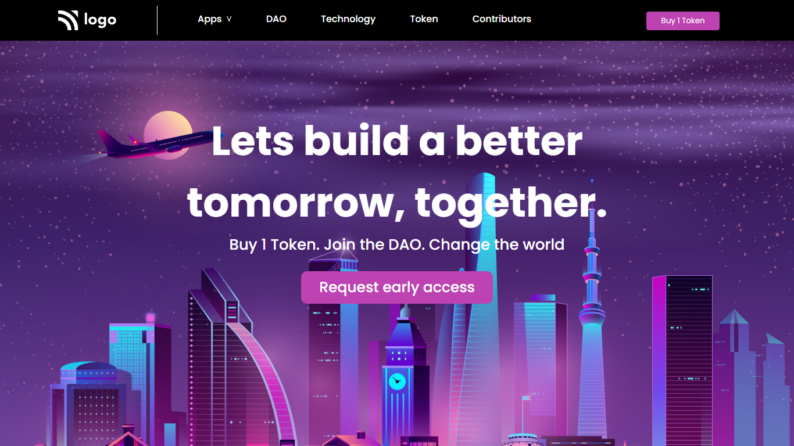

# Project 5 - Crypto Services Landing Page

  

 

[DEPLOYED WEBSITE LINK](https://fsbproject5.netlify.app/)

## What I learned from this Project?

- I learned about background image and text.
- Also button and font css.

## Completed the project in **1 hour**.